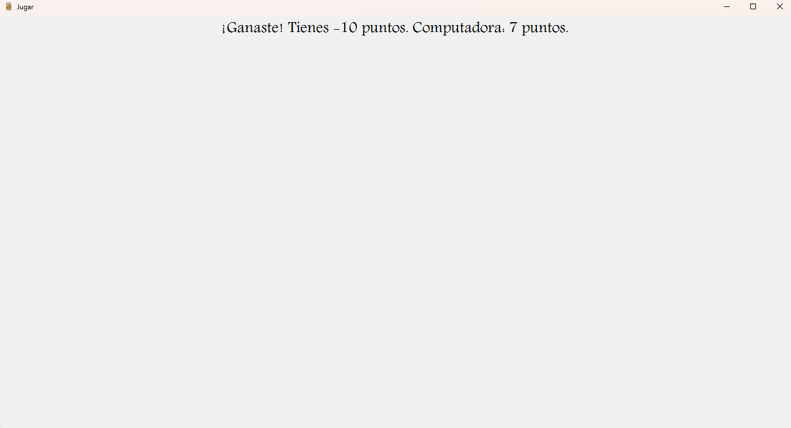

# Chinchón

Una aplicación para Windows hecha con WinForms y C# para jugar al chinchón contra una computadora.

*Nota: Esta aplicación es una demo y todavía tiene áreas que mejorar.*

**Necesitas [dotnet](https://dotnet.microsoft.com/en-us/download) para poder usar esta aplicación.**

## ¿Cómo jugar?

- Haz click en el botón que pone "Jugar".


- Reordena las cartas dentro de tu mano, haciendo click izquierdo, arrastra, y suelta.


- Roba del mazo, haz click en el mazo y descarta una de tus cartas; haciendo click, arrastrando a la pila de descarte, y suelta.


- Roba de la pila de descarte, arrastra desde la pila a tu mano, y descarta una de tus cartas.


- Y a la victoria:



## ¿Cómo lo descargo?

- En el apartado de "Releases":
	- Descarga el .zip más reciente.
	- Extrae el .zip a una carpeta.
	- Ejecuta el ejecutable.


## ¿Cómo lo compilo de forma local?

- Clona el repositorio a una carpeta local:
```bash
  git clone https://github.com/TasteLessTree/Chinchon.git
```

- Entra en dicha carpeta.

- Abre la solución (.sln) con Visual Studio.
 


- Comprueba que el proyecto compila:
	- En el explorardor de soluciones.
	- Haz click derecho en: Solución "Chinchon".
	- Compilar solución (ctrl. + shift + B).


- Ejecuta el código.


### Otra opción

- Una vez tengas el repositorio clonado, ejecuta este comando donde se encuentre la solución.

```powershell
  dotnet run
```

## Para un futuro

- Mejorar la UI.

- Añadir más sonidos al interactuar con una carta.

- La posibilidad de volver a jugar una vez se ha terminado la partida.

- Añadir un contador de puntuaciones. Ejemplo: perder por exceder el límite de puntos.

- La posibilidad de jugar contra una o más computadoras.

- Implementar el resto de reglas de "Tutorial".

## Autor

[TasteLessTree](https://github.com/TasteLessTree)

## Licencia

[Apache License, Version 2.0](https://www.apache.org/licenses/LICENSE-2.0)
